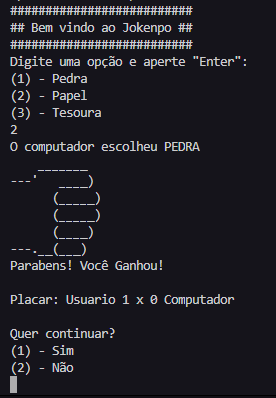

# Jokenpo - Jogo em Java 💻🎮

## Sobre o Jogo 📖

Jokenpo é um jogo para um player, onde o jogador enfrenta o computador em uma série de rodadas de Pedra, Papel e Tesoura. Após cada rodada, o placar é atualizado e exibido.

## Como Jogar 🕹️

1. Execute o arquivo do jogo com o comando `java -jar JokenpoGame.jar`
2. Escolha entre Pedra, Papel e Tesoura.
3. O computador fará sua escolha.
4. O resultado da rodada será exibido.
5. O placar será atualizado e exibido.
6. O jogo continuará até que você decida parar.

## Tecnologias Utilizadas 🛠️

Este jogo foi desenvolvido com:

* Java

## Autor 🖋️

Robson Silva
Email: orobsilva@gmail.com

## Licença 📄

Este projeto está sob a licença MIT.

## Como contribuir para o projeto 🤝

1. Faça um fork do projeto.
2. Crie uma nova branch para suas modificações: `git checkout -b my-feature`.
3. Salve suas modificações e crie uma mensagem de commit contando o que você fez: `git commit -m "feature: My new feature"`.
4. Envie suas alterações: `git push origin my-feature`.
